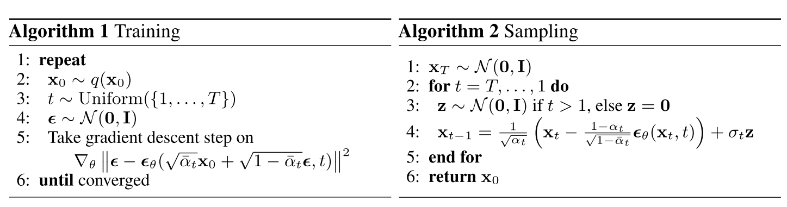

# Denoising Diffusion Probabilistic Model, in Pytorch

CSDN博客 | https://blog.csdn.net/u010006102/article/details/134648877?spm=1001.2014.3001.5502

## 论文中的两条公式

## 参考

- Denoising Diffusion Probabilistic Models (DDPM) | https://nn.labml.ai/diffusion/ddpm/index.html
- labmlai | https://github.com/labmlai/annotated_deep_learning_paper_implementations
- CelebA Dataset | https://mmlab.ie.cuhk.edu.hk/projects/CelebA.html
- U-Net model for Denoising Diffusion Probabilistic Models (DDPM) | https://nn.labml.ai/diffusion/ddpm/unet.html