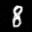

# ddpm-denoising-diffusion-pytorch

复现论文 Denoising Diffusion Probabilistic Model, in Pytorch。

- 论文 | <a href="https://arxiv.org/abs/2006.11239">Denoising Diffusion Probabilistic Model</a> 

- 论文中的【Algorithm 1 Training】和【Algorithm 2 Sampling】公式推导 | https://blog.csdn.net/u010006102/article/details/134648877
- 复现代码 | https://github.com/FMsunyh/denoising-diffusion-pytorch


## python环境
- torch 1.13.0
- python 3.10
 
## 训练数据
- celeba数据集 | https://mmlab.ie.cuhk.edu.hk/projects/CelebA.html
 
 百度云盘下载: CelebA/Img/img_align_celeba.zip

```
cp img_align_celeba.zip ./data/celebA/
cd ./data/celebA/
unzip img_align_celeba.zip
```

## 开启训练
- MNIST
```
python train.py --dataset mnist --epochs 6 --channels 1
```

- celebA
```
python train.py --dataset CelebA --epochs 100 --channels 3
```

## 输出路径
可以查看每一轮的预测结果
```
./outputs
```

## 测试效果


- MNIST数据集，训练6轮后的测试效果
 
|  |  |   |   |   |   |   |   |
| ------------------------------------ | ------------------------------------ | ------------------------------------- | ------------------------------------- | ------------------------------------- | ------------------------------------- | ------------------------------------- | ------------------------------------- |
|  |  |  |  |  |  |  |  |

- celebA数据集，训练50轮后的测试效果

|  |  |   |   |   |   |   |   |
| ------------------------------------- | ------------------------------------- | -------------------------------------- | -------------------------------------- | -------------------------------------- | -------------------------------------- | -------------------------------------- | -------------------------------------- |
|  |  |  |  |  |  |  |  |

## 优秀代码学习
- [Guide-to-training-DDPMs-from-Scratch](https://github.com/spmallick/learnopencv/tree/master/Guide-to-training-DDPMs-from-Scratch)

## 参考

- Denoising Diffusion Probabilistic Models (DDPM) | https://nn.labml.ai/diffusion/ddpm/index.html
- labmlai | https://github.com/labmlai/annotated_deep_learning_paper_implementations
- CelebA Dataset | https://mmlab.ie.cuhk.edu.hk/projects/CelebA.html
- U-Net model for Denoising Diffusion Probabilistic Models (DDPM) | https://nn.labml.ai/diffusion/ddpm/unet.html

## 看过的文章
- [由浅入深了解Diffusion Model](https://zhuanlan.zhihu.com/p/525106459)
- [An In-Depth Guide to Denoising Diffusion Probabilistic Models – From Theory to Implementation](https://learnopencv.com/denoising-diffusion-probabilistic-models/)


## AIGC学习交流
